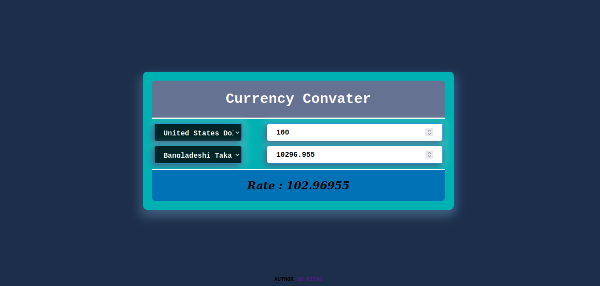

# currency convater App

## Table of Contents

- [Table of Contents](#table-of-contents)
- [Introduction](#introduction)
- [Features](#features)
- [View Live](#view-live)
- [Screenshot](#screenshot)
- [Built With](#built-with)
- [How To Use](#how-to-use)
- [Clone and Installation](#clone-and-installation)
- [Credit](#credit)
- [Contact](#contact)

## Introduction

> ### This is a simple Currency Converter application made with javascript. I took help from this website, "exchangerate-api" to create an API connection.

# Features

> - ###### Two currency selector
> - ###### Response without reloading page
> - ###### There is two up and down arrow to increase and decrease value
> - ###### A swap button to exchange currency dynamically
> - ###### Familiar with making requests
> - ###### Free third party API exchangerate-api.com

# View Live

> ### [View preview](https://shviper.github.io/currency-convater/)

# Screenshot



## Built With

- `HTML`
- `CSS`
- `Javascript`
- `exchangerate-api`

## How To Use

To clone and run this application, you'll need [Git](https://git-scm.com) installed on your computer. From your command line:

## Clone and Installation

```bash
git clone https://github.com/shviper/currency-convater.git
cd ./currency-convater
```

##### then open `index.html` file

## Credit

[Sajjad Hasan Riyad](https://www.facebook.com/shviper)

## Contact

- GitHub [@shviper](https://www.github.com/shviper)
- Twitter [@trshviper](https://www.twitter.com/trshviper)
